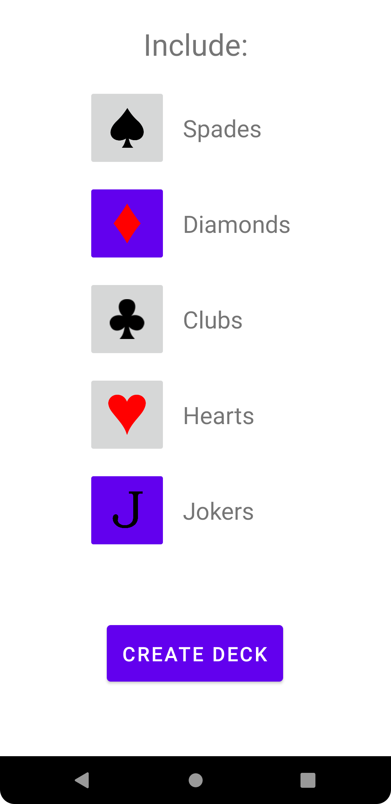
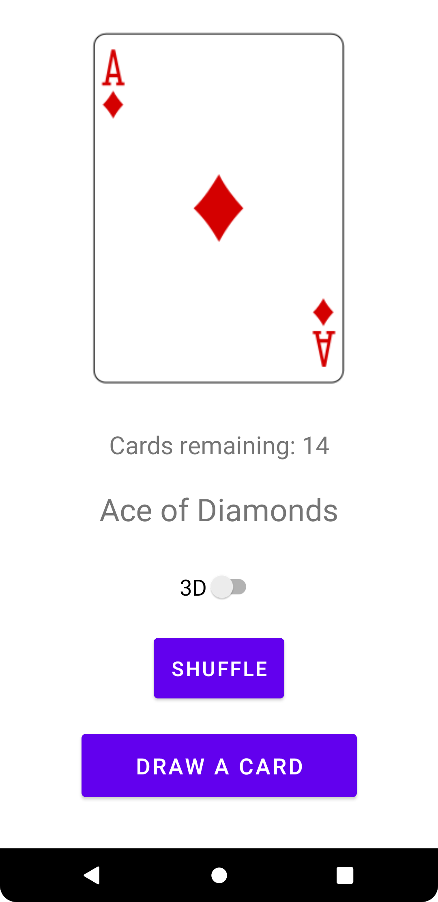
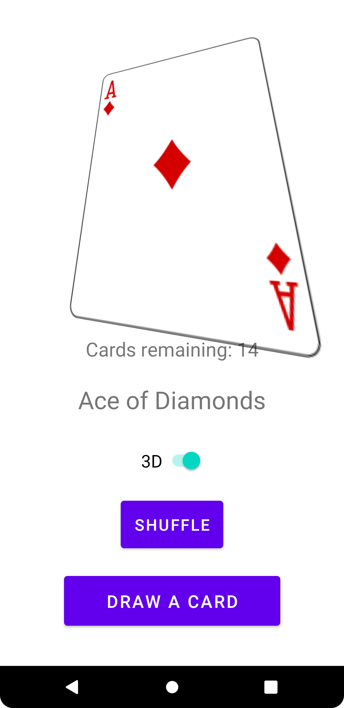

# Deck of Cards
Deck of Cards is an Android application that can be used to create decks and draw cards from them.
Created decks can be customized. Certain suits can be excluded and Jokers can be added.
When drawing cards from the deck, the deck can be shuffled or left in order.
Cards drawn from decks can be displayed in pseudo-3D by rotating the image based on the rotation of the device running the app.

# Author
Atte Ala-Lahti

# Technology
The app is created with Kotlin in Android Studio.
To manipulate decks of cards, the app uses Deck of Cards api:
https://deckofcardsapi.com/

# Google Play
The app is available to download from Google Play:
https://play.google.com/store/apps/details?id=fi.alalahti.deckofcards (currently unavailable until Google Play checks have gone through)

# Screenshots

